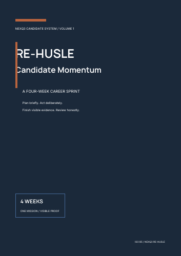
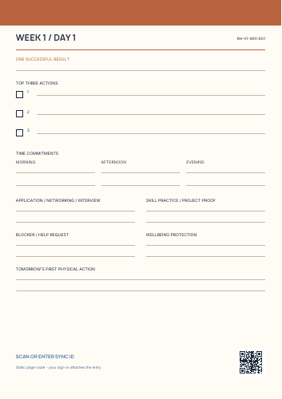

# NexQ³.ai

**AI-assisted CRM and business-operations prototype for recruitment, staffing and sales workflows.**

## Overview

NexQ³.ai is a personal SaaS product concept focused on bringing CRM activities, recruitment and staffing workflows, tasks, follow-ups and operational planning into one structured system. The project is being developed through product research, workflow design, documentation and early prototype architecture.

## Key Focus Areas

- CRM operations and pipeline organization
- Recruitment and staffing workflows
- Tasks, reminders and follow-ups
- AI-assisted workflow automation concepts
- Product planning, architecture and documentation

## Current Status

**Active development / prototype.** NexQ³.ai is an evolving project and is not a production-ready product. Current work focuses on validating workflows, defining the product structure and developing an initial prototype.

## Product Preview: Re-Hustle

Re-Hustle Candidate Momentum is a related physical execution product: a four-week career-sprint mission booklet paired with a 30-sheet daily execution pad. It is designed to turn goals, applications, skill practice and project work into visible evidence.

  
  

[View the Re-Hustle product overview](docs/product-overview.md) | [Open the screen proof](assets/product-documents/re-husle-v1-screen-proof.pdf)

## Repository Status

This public repository currently serves as a project showcase. No open-source licence has been granted at this stage.
