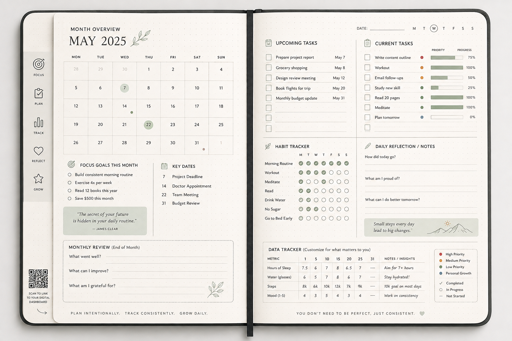
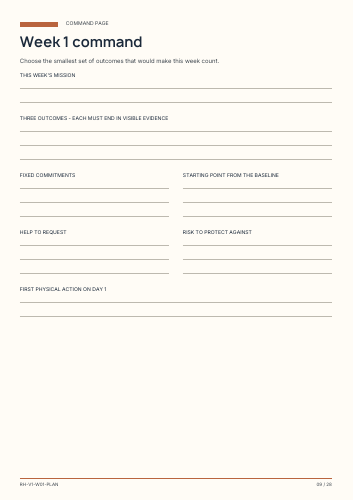
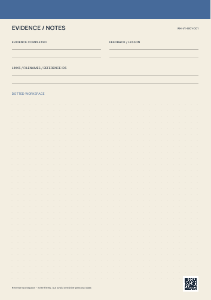

# Re-Hustle Product Overview

**A physical execution product within the NexQ³.ai product vision.**

## Overview

Re-Hustle Candidate Momentum is a four-week career-sprint system designed to help a candidate move from intention to visible evidence. It combines a 28-page mission booklet with a 30-sheet, double-sided execution pad.

The execution pad contains 28 daily sheets for a four-week cycle plus two flexible sheets for opportunity or interview preparation and a project proof-of-work sprint. It is a 30-sheet execution product, not a 30-week diary.

## Problem It Addresses

Career development, job searching and skill building can become scattered across notes, applications, calendars and unfinished plans. Re-Hustle creates a focused physical workflow for choosing a direction, protecting time, completing actions and recording proof.

## Product Components

### Mission Booklet

The mission booklet supports:

- Candidate baseline and target pathway
- A defined four-week mission
- Skills and evidence mapping
- Weekly commands, opportunity logs and action sprints
- Weekly reviews and blocker analysis
- Continue, stop and start decisions
- A final evidence review and next-cycle launch

### Daily Execution Pad

Each daily front sheet captures:

- One successful result
- Three priority actions
- Morning, afternoon and evening commitments
- Application, networking or interview activity
- Skill practice or project proof
- Blockers, help requests and wellbeing protection
- The first physical action for the following day

Each reverse sheet provides space for completed evidence, feedback, references and free-form notes.

### Flexible Proof Sheets

The final two sheets support:

- Opportunity and interview preparation
- A short project or proof-of-work sprint

## Core Workflow

**Plan. Act. Prove. Review.**

The system encourages brief planning, deliberate action, visible evidence and honest review. Its purpose is execution and learning rather than decorative journaling.

## Connection to NexQ³.ai

Re-Hustle explores how the NexQ³.ai workflow principles can extend into a physical product. The booklet and execution pad provide a tangible way to test planning, task execution, follow-ups, evidence tracking and review cycles before those ideas are expanded into connected digital workflows.

## Product Preview

The image below is an early planning-product visualization. It communicates the broader diary and execution concept but is not a final Re-Hustle production page.

The following pages are taken from the current Re-Hustle screen proof.

  
  
  
  

## Product Documents

- [View the 17-page screen proof](../assets/product-documents/re-husle-v1-screen-proof.pdf)
- [View the 4-page printer specifications](../assets/product-documents/re-husle-v1-printer-specifications.pdf)

## Current Status

**Active prototype / print-proof stage.** The structure, content, print specifications and physical workflow have been developed, but the product is still being reviewed and is not presented as commercially released or production-ready.

## Public Repository Boundary

This repository contains a curated screen proof and representative product images. The separate full print-production files are intentionally retained outside the public repository.
